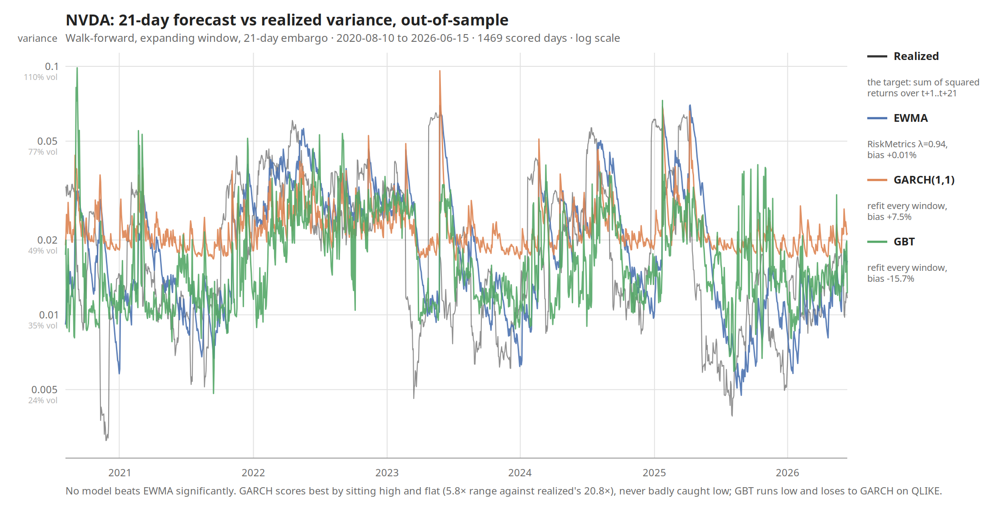

# Forecasting NVDA's realized variance

**Question.** Does a GARCH(1,1) or a gradient-boosted tree forecast NVDA's
21-day-ahead realized variance better than a two-line EWMA, out-of-sample, under
walk-forward evaluation?

**Answer.** No. Neither beats the EWMA baseline by a statistically significant
margin. The only significant difference anywhere in the study is GARCH beating
the gradient-boosted tree — the simpler model winning.



## Results

1469 out-of-sample days (2020-08-10 to 2026-06-15), 71 walk-forward windows,
none of which failed to converge. Lower is better for both losses.

| Model | QLIKE | MSE | mean forecast | bias vs realized |
|---|---|---|---|---|
| EWMA | 0.244398 | 2.358e-4 | 0.021189 | **+0.008%** |
| **GARCH(1,1)** | **0.206439** | **2.132e-4** | 0.022777 | +7.5% |
| GBT | 0.286787 | 2.438e-4 | 0.017854 | −15.7% |

Mean realized 21-day variance over the same days: 0.021188 (50.4% annualized
volatility).

Diebold-Mariano tests, Newey-West standard errors at `q = h-1 = 20` lags. A
positive statistic means the first model is worse. Statistics and p-values are
the Harvey-Leybourne-Newbold small-sample versions.

| Comparison | Loss | statistic | p | HAC/naive se | verdict at 5% |
|---|---|---|---|---|---|
| EWMA vs GARCH | QLIKE | 1.096 | 0.273 | 3.55× | not significant |
| EWMA vs GARCH | MSE | 1.024 | 0.306 | 3.11× | not significant |
| EWMA vs GBT | QLIKE | −1.594 | 0.111 | 3.04× | not significant |
| EWMA vs GBT | MSE | −0.270 | 0.787 | 2.81× | not significant |
| GARCH vs GBT | QLIKE | −2.196 | **0.028** | 3.38× | **significant** |
| GARCH vs GBT | MSE | −1.324 | 0.186 | 2.24× | not significant |

The two losses agree on the ordering, so there is no loss-disagreement finding
to report.

### The `HAC/naive se` column is the result

That column is the ratio of the Newey-West standard error to the naive one. It
runs 2.2× to 3.6× across every comparison, and it is the difference between this
study's conclusion and its opposite.

Consecutive 21-day forward windows share 20 of their 21 returns, so the loss
differentials are heavily autocorrelated. Treating 1469 overlapping observations
as independent understates every standard error by roughly a factor of three.
Under a naive standard error, EWMA vs GARCH on QLIKE reads t = 3.94, p < 0.0001
— a clean, publishable-looking win for GARCH. It is an artifact. The effective
sample here is closer to 70 observations than 1469.

### Why GARCH scores best without forecasting better

GARCH's forecasts span 5.8× from smallest to largest. Realized variance spans
20.8×. GARCH sits high and nearly flat around 0.021, three to four times too
high through the calm stretches of 2021, 2023 and late 2025 — and it is
therefore never badly caught low. QLIKE punishes under-prediction far harder
than over-prediction, so a stable, upward-biased forecast scores well without
tracking anything.

EWMA has almost exactly the right level (its mean forecast is within 0.008% of
mean realized variance, which is a property of the estimator, not tuning) and
visibly the right shape, but it is a trailing estimator: it turns after the
target does, so it is pointing the wrong way at every turning point.

GBT tracks the shape best of the three — it spans 20.5× against realized's
20.8× — but sits about 16% low throughout, and that is what sinks its score.

### Why GBT runs low

The tree is trained on `log(variance)` and its predictions are converted back
with `exp`. Variance is bounded below by zero and heavily skewed; on the raw
scale a squared-error split criterion chases a handful of crisis months and
ignores everything else, so the log target is what makes the model fit at all.

But `exp(mean of logs)` is the geometric mean, not the arithmetic mean, so the
back-transform is biased low by construction. Under QLIKE that is the expensive
direction to be wrong in.

**This bias is left uncorrected on purpose.** The transform was chosen before
any score was seen. Applying a bias correction after seeing that GBT came last
would be fitting the test set through the back door. The honest report is the
number the pre-committed choice produced.

## Method

**Data.** 2512 NVDA daily closes, 2016-07-19 to 2026-07-16, giving 2511 daily
log returns. Close-only — no high-low range, no volume. Frozen in
`data/prices_10y.csv` and never re-pulled.

**Target.** Total realized variance over the next 21 trading days: the sum of
squared log returns from `t+1` to `t+21`. Everything is fitted and scored in
variance units; square roots appear only in reporting.

**Models.**

- **EWMA** — RiskMetrics, λ = 0.94, no fitted parameters. The 21-day forecast is
  21 × the one-step forecast.
- **GARCH(1,1)** — hand-coded likelihood, optimizer setup and robust standard
  errors, refit inside every window. Cross-checked against `ARCHModels.jl`:
  ω, α, β, μ and the log-likelihood agree to about 7 significant figures, and
  Huber sandwich standard errors agree to 2e-6.
- **GBT** — `EvoTrees.jl`, refit inside every window, trained on log-variance.
  Six close-derived features: trailing realized variance over 5, 21 and 63 days;
  the day's return; the mean of the last 5 returns; and EWMA's own forecast.
  Hyperparameters were fixed in advance and never tuned against the test period.

**Evaluation.** Expanding-window walk-forward. Training starts at index 1 and
grows; the first forecast comes after 1000 days (~4 years); models are refit
every 21 days. A **21-day embargo** separates the end of each training window
from the start of its test window, because a 21-day forward target computed at
the last training day would otherwise be built from returns inside the test
period.

Every model sees the identical harness and is scored on the identical day set —
a day missing from any model is dropped from all of them.

**Losses.** QLIKE (`RV/F − ln(RV/F) − 1`) and MSE, both reported. Both remain
consistent when the "truth" is itself a noisy proxy (Patton 2011). QLIKE is the
headline because it is built for variance and punishes under-prediction hardest.

## Limitations

Read these before quoting any number above.

- **The effective sample is about 70 observations, not 1469.** Overlapping
  windows. Every conclusion is drawn from a small sample, and "no significant
  difference" is partly a statement about statistical power.
- **One ticker, one period.** NVDA from 2016 to 2026 is a single, unusually
  volatile path. Nothing here generalizes without re-running elsewhere.
- **GBT has no information advantage.** With close-only data, its features are
  derived from the same returns EWMA already uses. It is a more flexible
  functional form applied to identical information, so a null result was the
  likely outcome and should not be read as "trees don't work for volatility."
- **GBT's back-transform bias is uncorrected** (see above).
- **λ = 0.94 is a convention, not a fitted value.** It was not optimized for
  this sample — which is part of why the baseline is honest, but it does mean
  EWMA was not given its best shot either.
- **Expanding window only.** A rolling window was not tested; it is a live
  decision, not a settled one.
- **GARCH non-convergence handling is untested.** All 71 windows converged here,
  so the policy for a failed fit was never exercised.
- **No economic evaluation.** No transaction costs, no option P&L, no position
  sizing. Lower QLIKE is not the same as making money.

## Running it

```sh
julia --project=. -e "using Pkg; Pkg.instantiate()"   # one-time, pinned versions
julia --project=. checks.jl                            # 24 sanity checks (a-x)
julia --project=. experiment.jl                        # walk-forward + results + DM
julia --project=. chart.jl                             # redraws the chart from the CSV
```

`checks.jl` must print `All sanity checks passed.` Every check uses inputs whose
correct answer is derivable by hand — pencil-and-paper cases, not property
tests. Several are leakage probes: they perturb the future and assert that
features, targets and forecasts at earlier indices do not move.

`Manifest.toml` is committed deliberately so a fresh clone rebuilds the identical
environment. `results/walkforward.csv` holds the per-day forecasts and is
committed too, so every number above can be reproduced without refitting.

The GBT seed is pinned: `EvoTrees` subsamples rows and columns, and without a
fixed seed a fresh clone would not reproduce these results.

## Layout

```
experiment.jl           walk-forward, three-model results table, DM tests
chart.jl                forecast-vs-realized SVG (written directly, no plotting dep)
checks.jl               hand-verifiable sanity checks, one per core piece
main.jl                 the original Black-Scholes v0 pipeline

src/data.jl             Yahoo chart endpoint + CSV cache
src/volatility.jl       log returns, annualized volatility
src/black_scholes.jl    bs_d1_d2, bs_call_price
src/realized_vol.jl     forward (target) and trailing (feature) realized variance
src/ewma.jl             RiskMetrics EWMA variance path and h-step rule
src/garch.jl            GARCH(1,1) by hand-coded MLE, h-step forecast
src/features.jl         GBT feature matrix
src/loss.jl             QLIKE, MSE, mean_loss
src/walk_forward.jl     expanding-window splits, per-window refits
src/dm.jl               Diebold-Mariano with Newey-West standard errors

data/prices_10y.csv     frozen sample: 2512 closes, 2016-07-19 to 2026-07-16
results/walkforward.csv per-day forecasts for all three models
```

## Repository name

The name reflects where this started: an option-pricing pipeline. `main.jl`
still runs that original code — fetch prices, estimate historical volatility,
price a European call with Black-Scholes. Black-Scholes takes a volatility
input, and everything downstream depends on where that number comes from —
which is the question this repo now answers.
